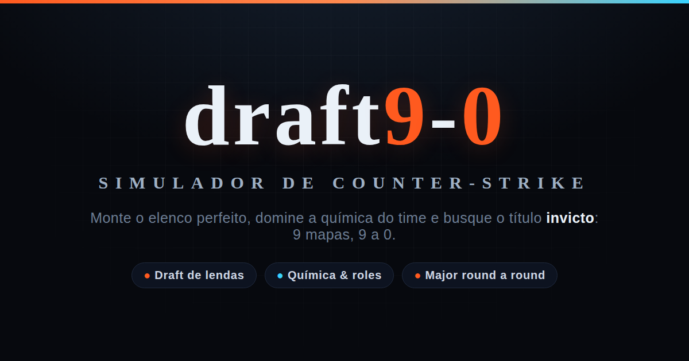

# draft9-0 · Simulador de Counter-Strike

> **▶ Jogue agora:** <https://esteban-brito.github.io/Teste/>

Jogo de navegador (HTML/CSS/JavaScript, sem dependências de runtime nem build) onde você
monta um elenco de Counter-Strike sorteando times históricos, escolhe jogadores
e um treinador, e tenta a campanha invicta (9-0) em um Major com fase suíça e
playoffs.



## Desenvolvimento

O mapa técnico e as regras para mudanças estão em:

- [`AGENTS.md`](AGENTS.md): invariantes, branch, validação e disciplina de commits;
- [`docs/project-context.md`](docs/project-context.md): ponto de retomada, roadmap
  de profissionalização e visão do modo Carreira de Jogador;
- [`docs/next-steps.md`](docs/next-steps.md): sequência aprovada para auditoria
  individual, variância, modo campanha, balanceamento condicional e retomada;
- [`docs/architecture.md`](docs/architecture.md): fluxo de dados e fronteiras;
- [`docs/testing.md`](docs/testing.md): 24 suítes e comandos por camada;
- [`docs/rating-balance-2026-07-20.md`](docs/rating-balance-2026-07-20.md): auditoria sem curadoria e comparação antes/depois;
- [`docs/fidelity-corpus.md`](docs/fidelity-corpus.md): coleta e auditoria do corpus IFCS;
- [`docs/fidelity-target.json`](docs/fidelity-target.json): alvo histórico
  congelado, com janela, população, fontes e hashes;
- [`docs/realism-methodology.md`](docs/realism-methodology.md): metodologia IFCS
  para medir fidelidade ao CS profissional em escala de 0 a 100;
- [`docs/formulas/`](docs/formulas/): roles, playstyles, OVR e química;
- [`docs/adr/`](docs/adr/): decisões arquiteturais registradas.

Para preparar e validar o repositório:

```bash
npm ci
npm run validate
```

## Como jogar

Abra <https://esteban-brito.github.io/Teste/> — ou baixe e abra o
`index.html` em qualquer navegador moderno. Não precisa instalar nada: o jogo é
só HTML, CSS e JavaScript estáticos. Mantenha os três arquivos (`index.html`,
`style.css`, `game.js`) na mesma pasta.

1. **Sorteie um time** na roleta.
2. **Escolha 1 carta** (jogador ou treinador) do time sorteado por rodada.
3. Repita até completar **5 jogadores + 1 treinador**.
4. Acompanhe a **Força efetiva** (força bruta × química × treinador) e os selos
   de análise do elenco.
5. Entre no **Major** e dispute a fase suíça e os playoffs rumo ao título.

Toque no ícone **⟲** no canto de uma carta para **virá-la**: o verso de um
**jogador** mostra o estilo dele e 4 stats (Firepower, Abertura, Clutch,
Utilitário); o verso de um **treinador** explica o que a característica dele
(Gestor, Desenvolvedor, Estrategista, Motivador) faz pelo time. Tocar no corpo
da carta continua escolhendo/posicionando normalmente. As cartas usam proporção
5/7 e se adaptam a qualquer tela.

## Estrutura do projeto

```
draft9-0/
├── index.html            ← página principal do jogo
├── style.css             ← todos os estilos (tema, cartas, roleta, overlays)
├── game.js               ← aplicação, estado e UI
├── src/
│   ├── data/             ← dados crus catalogados
│   ├── domain/           ← avaliação, química, simulação, narrativa e estatística
│   ├── application/      ← efeitos e serviços da aplicação no navegador
│   ├── infrastructure/   ← adaptadores de navegador e persistência
│   ├── public/           ← APIs públicas compartilhadas pelos consumidores
│   └── ui/               ← renderizadores e utilitários puros de interface
├── elencos.html          ← base de elencos (página standalone)
├── sandbox.html          ← bancada de tuning + calibrador inteligente
├── calibrador-worker.js  ← Web Worker do calibrador (busca em paralelo)
├── fonts.css + fonts/    ← fontes auto-hospedadas (Chakra Petch + Barlow, sem CDN)
├── og-image.png · robots.txt · .gitignore
├── ADD_TEAM.md           ← documentação: como adicionar um time
├── package.json · eslint.config.mjs   ← scripts e lint (dev; sem deps de runtime)
├── .github/workflows/    ← CI: valida (check + lint + bench) e faz deploy no Pages
├── bancada/              ← suíte de validação dos motores (Node)
│   ├── motor.js · common.js       ← ponte CommonJS para a API pública + utilitários
│   ├── run.js                     ← roda a suíte inteira
│   ├── times.js · realismo.js · rating.js   ← lint de dados + fidelidade
│   ├── roster.js                  ← regenera elencos.html
│   ├── snapshot.js + roster-snapshot.json   ← trava a classificação aprovada do elenco
│   ├── drop-reform.js · auditoria.js        ← guardas estruturais do motor
│   ├── fidelity-score.js · fidelity-corpus.js ← scorer e contrato auditável do IFCS
│   └── calibrador*.js · worker-calibrador.js · e2e-*.js   ← calibrador e testes de navegador
└── tools/
    ├── add-team.js            ← adiciona time a partir de texto simples
    ├── verify-report.js       ← confere se um relatório do sandbox foi aplicado fielmente
    ├── score-fidelity.js · verify-fidelity-corpus.js ← CLIs do IFCS
    ├── extract-fidelity-demo.py ← extrator científico offline de demos CS2
    ├── check-sandbox-*.js     ← checagens de sintaxe/motor
    └── serve-static.js        ← servidor local estático
```

## Os 6 motores

O `game.js` contém a aplicação e a UI (roleta, elenco e torneio). Os motores
vivem em `src/domain/` e são compostos por `src/public/simulation-api.mjs`; jogo,
sandbox, worker e bancada usam essa mesma API. O pipeline é:

```
atributos crus
    │
    ├── PRISMA ─────── classifica o jogador: função principal/secundária
    │                  e papel de combate do IGL. Tudo por afinidade contínua.
    │
    ├── ZÊNITE ─────── condensa identidade + atributos + rating num ÚNICO
    │                  número (OVR 5–22). Curva logística, sem cliffs.
    │
    ├── SINAPSE ────── lê o elenco: cobertura de pilares, saturação, egos,
    │                  treinador → química (50–100%) e força efetiva.
    │
    ├── MARÉ ────────── "humor competitivo": OVR × perfil → forma
    │                  da noite/campanha. Motor de variância do roguelike.
    │
    ├── PÓLVORA ────── combate round a round: duelos, vantagem de homem,
    │   └─ COFRE ──── clutch, plant/post-plant/retake + economia.
    │
    └── FALLEnANGELs ─ rating contextual pós-combate (estilo HLTV):
                       KAST, ADR, swing, multi-kill, eco-adjust.
```

### Onde mexer no balanceamento

Os números ficam concentrados em blocos `CFG_*` no topo do `game.js`:

| Bloco | O que controla |
|---|---|
| `ROLE_PERFIL` | Pesos de **afinidade** (classificação) e **OVR** (nível) por função |
| `CFG_AVALIACAO` | Curva `core → OVR` (logística, satura em 22), regras do IGL |
| `CFG_QUIMICA` | Penalidades por falta de role, saturação, egos; mitigadores do treinador |
| `CFG_SIM` | Simulação: lados, economia, momentum, mapas |
| `CFG_FA` | Rating estilo HLTV: pesos de kill, sobrevivência, KAST, impacto por função |

## A bancada de tuning (sandbox)

O `sandbox.html` é um laboratório independente que carrega os motores do
`game.js` ao vivo e permite editar:

- **Atributos de um jogador** (sliders) e ver o efeito no OVR, função e playstyle
- **Pesos dos motores** (curva, afinidade, química, simulação, rating)
- **Receitas dos 10 playstyles** universais + Coringa
- **Simulação de mapa**, lote A × B ou amostra round-robin da liga com os valores editados

Na aba **Simular**, o modo de liga distribui os confrontos em round-robin e
compara combate, lados, plant, pós-plant, economia, pistol, clutches, funções e
rating com as mesmas faixas dos benchmarks. Intervalos de 95% distinguem
oscilação de amostra de desvio material; métricas raras sem observações
suficientes ficam pendentes no diagnóstico legado do sandbox.

O painel de desvios mostra todos os jogadores que participaram: dez no confronto
A × B e até os 85 na amostra da liga. Ele mantém rating histórico, média
simulada, delta e quantidade de mapas, ordenados por desvio absoluto. Média,
mediana, desvio-padrão, percentis e intervalo individual ainda pertencem à
próxima etapa documentada em [`docs/next-steps.md`](docs/next-steps.md).

Esse painel não é a nota científica IFCS. No IFCS, falta de volume no corpus
real impede publicar a nota; falta de uma saída exigida do simulador recebe zero
na métrica. Os critérios completos estão em
[`docs/realism-methodology.md`](docs/realism-methodology.md).

Tudo é comparado contra o **baseline** (estado inicial ao carregar). O painel
de impacto mostra o que mudou. Nada é salvo nem aplicado ao jogo — é isolado.

### Playstyles universais

10 estilos que servem pra qualquer função, cada um com uma "receita" de pesos:

| Estilo | Foco | Rating peso |
|---|---|---|
| Agressivo | Entrada + abertura | 40% |
| Spacetaker | Abertura + fogo + entrada | 52% |
| Trader | Trade + fogo + utilitário | 48% |
| Playmaker | Fogo + abertura | 60% |
| Infiltrador | Clutch + abertura + fogo | 52% |
| Baiter | Trade + clutch + fogo | 32% |
| Clutcher | Clutch + fogo | 52% |
| Suporte | Utilitário + trade + abertura | 40% |
| Cerebral | Abertura + utilitário + clutch | 52% |
| Âncora | Clutch + utilitário + trade | 45% |

**Coringa** (joker): 5 de 7 stats acima do piso (`pisoMin`). Tolerância 1
stat fraco. Spread máximo controlável.

### Química (SINAPSE)

A química começa em 100% e é afetada por:

- **Sinergias** (bônus): Ponta de Lança, Dupla Dinâmica, Entry+Trade, Espaço+Lucro,
  Estrela Apoiado, Utility Combo, Split Setup, Rede de Informação, Retake Perfeito,
  Coringa+Agressivo, Coringa+Cerebral
- **Conflitos de playstyle** (penalidade): Saturação de Playmakers, Covardia Tática,
  Invasão de Espaço, Guerra de Estrelas
- **Cobertura de funções** (penalidade): falta de IGL, AWP, Entry, Âncora;
  saturação de qualquer role
- **Treinadores** (mitigam conflitos de playstyle, empilham):
  Estrategista, Gestor, Motivador, Desenvolvedor
- **Coringa** mitiga conflitos de playstyle (não de cobertura)

Bônus e penalidades são calculados separados. O Coringa divide só
penalidades de playstyle pela metade.

## A base de elencos

O `elencos.html` é uma página standalone que mostra todos os times, jogadores
e treinadores com OVR, funções, atributos e rating. Os dados são gerados
automaticamente a partir dos motores — nunca editados à mão.

Para regenerar: `node bancada/roster.js`

## Como adicionar um time

```
# 1. Escreva o time no formato simples (ver ADD_TEAM.md para detalhes)
# 2. Rode o gerador:
node tools/add-team.js caminho/do/time.txt

# 3. Valide:
npm run validate

# 4. Faça um commit separado. Push e deploy somente com autorização do responsável.
```

O gerador insere os 5 jogadores e o time no `game.js`, regenera a base de
elencos e roda o lint. Veja `ADD_TEAM.md` para o formato completo.

## Suíte de validação (bancada)

A pasta `bancada/` contém uma suíte de validação que roda no Node.js:

| Arquivo | O que valida |
|---|---|
| `times.js` | IDs únicos, atributos 0–100, ≥1 IGL, país do treinador, ≥16 times |
| `realismo.js` | KPR, CT-win, plant, clutch 1vX, anti-eco, conversão pós-pistol vs CS real; e a **forma** (kills por round, placar do perdedor, método do round, compra por lado) |
| `rating.js` | Relatório de correlação real×sim (a correlação era circular e deixou de ser gate em 26/07/2026); só a cobertura 85/85 reprova |
| `perfis.js` | Coerência de carta: assinatura por função e playstyle, sobreposição entre bandas de OVR, variância intra-jogador e peso do contexto |
| `dificuldade.js` | P(título) e P(campanha invicta) com IC95%, replicando o Major (suíça + playoffs), mais a curva invicto × esforço de draft |
| `abertura.js` | Nenhum peso negativo pode entrar no sorteio do duelo de abertura |
| `sweep.test.js` | Varredura pareada e intervalo de proporção: braços isolados, valor restaurado, Wilson conferido |
| `campanha-major.js` | Não é suíte: é o Major replicado fora da UI, usado pela dificuldade e pelas varreduras |
| `run.js` | Roda as 24 suítes; aceita grupos de dados, regressão, calibrador, benchmark, fidelidade e E2E |

```bash
npm run test:data          # integridade dos dados
npm run test:regression    # auditoria + snapshot + guardas históricas + golden por seed
npm run test:calibrator    # calibrador e workers
npm run test:benchmark     # realismo + assists + KDA + rating + perfis + dificuldade
npm run test:fidelity      # scorer e contrato do corpus IFCS
npm run test:e2e           # calibrador, aba Simular e jogo principal no navegador
npm run test:all           # todas as 24 suítes
npm run validate           # check + lint + todas as 24 suítes
npm run score:fidelity -- caminho/entrada.json  # calcula um relatório IFCS
npm run corpus:fidelity -- --template  # modelo do manifesto auditável
```

O extrator já passou por uma prova repetida com uma demo CS2 real, registrada em
`fidelity-corpus/parser-proof.json`. Essa entrada acadêmica valida o pipeline,
mas não conta como partida profissional e ainda não permite publicar a nota.
O primeiro mapa profissional elegível está selado no manifesto parcial
`fidelity-corpus/manifest.json`; ainda são necessários 800 mapas auditados.

O diagnóstico técnico mais recente obteve **96/100** em 4.000 mapas simulados:
131 de 136 avaliações de indicadores ficaram dentro das faixas profissionais.
Esse valor está registrado em `docs/fidelity-technical-baseline.json` e **não é
a nota IFCS oficial**, que continua bloqueada até o corpus e o holdout completos.

## Acessibilidade, mobile e desempenho

- **Responsivo**: 6 colunas no PC, 3 no celular; suporta o notch/barra do iPhone
  (`viewport-fit=cover` + `safe-area-insets`) e altura dinâmica (`100dvh`).
- Respeita `prefers-reduced-motion` (desliga animações pesadas).
- Overlays marcados como diálogos (`role="dialog"`/`aria-modal`); foco por teclado.
- Áudio sintetizado via Web Audio (sem arquivos externos); botão de mudo.
- O jogo publicado não tem dependências externas de runtime, build ou framework.
- Ferramentas de desenvolvimento usam Node; a pesquisa IFCS usa Python/Awpy
  apenas offline, em ambiente isolado, e não é carregada pelo jogo.

## Diagnóstico histórico de fidelidade dos motores

As métricas abaixo são uma referência histórica da bancada `realismo.js`
(`N=300+`). Elas são guardas de regressão e não constituem uma nota IFCS nem uma
alegação de “X% realista”. O retrato completo está em
[`docs/baseline.md`](docs/baseline.md); a metodologia oficial está em
[`docs/realism-methodology.md`](docs/realism-methodology.md).

| Métrica | Simulado | Real |
|---|---|---|
| Rounds/mapa | 20.4 | 20–22 |
| Overtime | 8.2% | 8–14% |
| Pistol win CT | 51.0% | 50–55% |
| KPR | 0.71 | 0.66–0.72 |
| CT-round win | 50.7% | 47–54% |
| Plant | 53–58% | 46–60% |
| Clutch 1v1/1v2/1v3 | 50/23.5/8.1% | 44-56/18-28/5-13% |
| Rating correlação r | 0.81 | ≥0.75 |
| Rating erro médio | 0.087 | ≤0.12 |

Essas duas linhas pertencem ao baseline histórico de 19 de julho de 2026. Após
a recalibração publicada em `626b7ed`, a execução controlada obteve correlação
0,946, MAE 0,052, inclinação 0,998 e maior erro individual 0,18. Consulte
[`docs/rating-balance-2026-07-20.md`](docs/rating-balance-2026-07-20.md).
